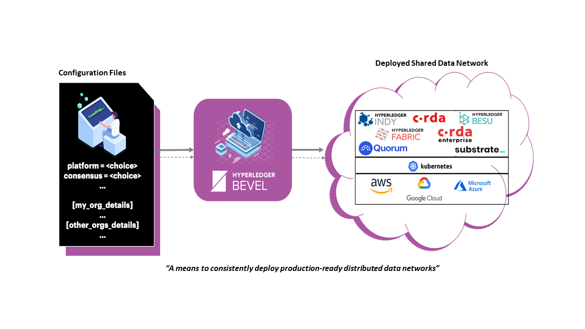
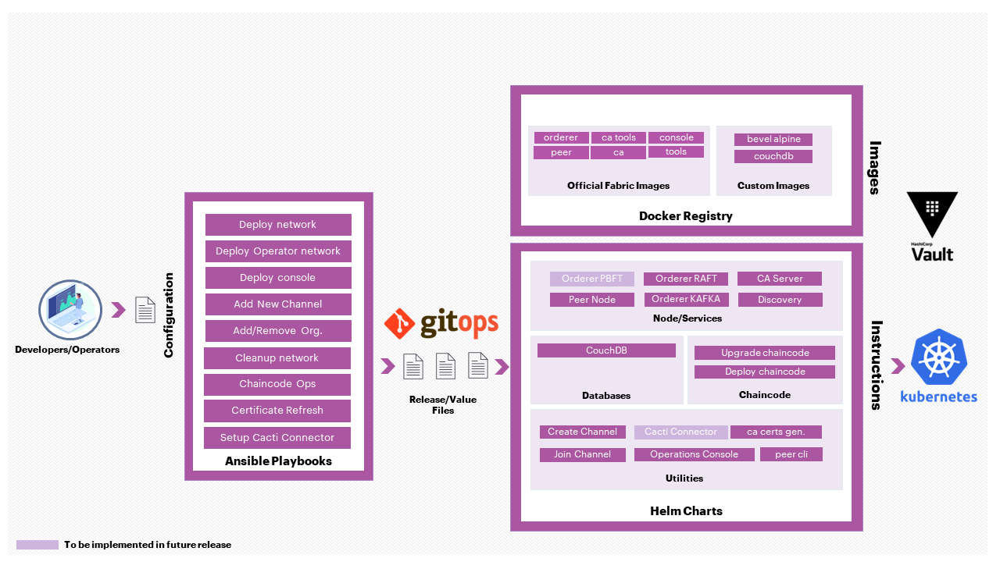

# Hyperledger Bevel [join the chat][chat-url]

[](LICENSE) [](https://hyperledger-bevel.readthedocs.io/en/latest/?badge=latest) [](https://bestpractices.coreinfrastructure.org/projects/3548)
[](https://github.com/hyperledger/bevel/actions/workflows/dci_lint.yml)

- [Short Description](#short-description)
- [Scope of Project](#scope-of-project)
  - [Getting Started](#getting-started)
  - [Hyperledger Fabric](#hyperledger-fabric)
  - [Corda Enterprise](#corda-enterprise)
  - [Corda Opensource](#corda-opensource)
  - [Hyperledger Indy](#hyperledger-indy)
  - [Quorum](#quorum)
  - [Hyperledger Besu](#hyperledger-besu)
- [Contact](#contact)
- [Contributing](#contributing)
- [Initial Committers](#initial-committers)
- [Sponsor](#sponsor)

## Breve Descripción

Un marco de automatización para implementar de manera rápida y consistente plataformas de tecnología de contabilidad distribuida (DLT) listas para producción.

## Alcance del proyecto

Hyperledger Bevel ofrece un marco de automatización para implementar de manera rápida y consistente plataformas DLT listas para producción en la infraestructura de la nube.

Hyperledger Bevel es un acelerador/herramienta que ayuda a los desarrolladores a configurar e implementar rápidamente redes DLT seguras, escalables y listas para producción que también permite que nuevas organizaciones se incorporen fácilmente a la red. Bevel facilita una forma segura de implementar y operar diferentes plataformas DLT.

Incluye:

- Helm charts para deploy diferentes nodos DLT y generar las criptomonedas/identidades relacionadas.
- Helm charts para diversas funciones operativas, como agregar nuevos nodos e implementar contratos inteligentes.
- Helm charts para implementar conectores Hyperledger Cacti para redes Fabric, Quorum y Besu.
- Guías de Ansible y definiciones de roles modulares para automatizar la implementación para Helm charts.
- Ansible playbooks y roles para automatizar la implementación de Hyperledger Fabric utilizando bevel-operator-fabric (operador de Kubernetes para administrar redes Hyperledger Fabric).
- CD integrado que utiliza GitOps para que una vez configurada la red, todos los cambios se puedan realizar a través de git PRs/merges.
- Configuración para Ambassador Edge Stack, HAProxy (para Hyperledger Fabric) e Isto Ingress (para Substrate) para actuar como controlador

Hyperledger Bevel actualmente es compatible con R3 Corda OS y Enterprise, Hyperledger Fabric, Hyperledger Indy, Hyperledger Besu, Quorum y Substrate. Se pueden agregar fácilmente otras plataformas DLT.

### Empezar

Para comenzar rápidamente con el marco, siga nuestras [pautas de introducción](https://hyperledger-bevel.readthedocs.io/en/latest/gettingstarted.html) .

La documentación detallada para operadores y desarrolladores está disponible en [nuestro sitio ReadTheDocs](https://hyperledger-bevel.readthedocs.io/en/latest/index.html) .

La documentación también se puede crear localmente siguiendo las instrucciones de la `docs`carpeta.

### Hyperledger Fabric

Para Hyperledger Fabric, utilizamos los contenedores Docker oficiales proporcionados por ese proyecto. Varios scripts de Ansible diferentes le permitirán crear una nueva red (a través de nubes) o unirse a una red existente.



## Contact

Agradecemos sus preguntas y comentarios sobre nuestro [Discord channel](https://discord.com/channels/905194001349627914/941739691336679454). [Please join our Discord first](https://discord.gg/hyperledger).

## Contributing

Agradecemos las contribuciones a Hyperledger Bevel de muchas formas, ¡y siempre hay mucho que hacer!

Revise las pautas [contributing](./CONTRIBUTING.md) para comenzar.

# Construir

Si no está utilizando los scripts de automatización de Jenkins proporcionados, puede ejecutar los scripts de aprovisionamiento dentro de un tiempo de ejecución de Docker independiente de su clúster de Kubernetes de destino.

```
# Build provisioning image
docker build . -t ghcr.io/hyperledger/bevel-build

# Run the provisioning scripts
docker run -it -v $(pwd):/home/bevel/ ghcr.io/hyperledger/bevel-build
```

## Initial Committers

- [tkuhrt](https://github.com/tkuhrt)
- [jonathan-m-hamilton](https://github.com/jonathan-m-hamilton)
- [sownak](https://github.com/sownak)

## Patrocinado

Mark Wagner (Github: [n1zyz](https://github.com/n1zyz), email: [mwagner@redhat.com](mailto:mwagner@redhat.com)) - TSC Member

[chat-url]: https://discord.gg/hyperledger
[chat-image]: https://img.shields.io/discord/905194001349627914?logo=Hyperledger&style=plastic.svg
